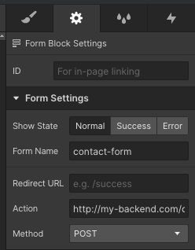

# Webflow Form

Setup your form to send some request and control the success and failing flow.

## Usage

Configure your form id, action and method. E.g.:

</img>

**IMPORTANT**: Set your form name in lowercase, without accents or special characters and with words separated by `-`.
- Bad: `@my form`, `Fomulário de contato`.
- Good: `contact-form`, `newsletter`, `ebook-request`.


Continuing... embed the package script in your webflow project and call the function `setUpWebflowForm` passing your form name (The same defined on form settings above). E.g.:

```html
<script onload="setUpWebflowForm('contact-form')" src="https://unpkg.com/@smartins/webflow-form"></script>
```

**Hint:** Click [here](https://university.webflow.com/lesson/custom-code-embed) for more details how to add an embed.

When the form was submitted a request will be sent to URL defined on `action` with `method` (POST, by default) and form data obtained from inputs inside your `form` element.

### Setup options

The function `setUpWebflowForm` can receive some options in your second parameter:

| Option                | Type                   | Description                                                                                                                   | Default value  |
|-----------------------|------------------------|-------------------------------------------------------------------------------------------------------------------------------|----------------|
| doneBlockSelector     | string                 | The selector of the element that contains the block to show on success.                                                       | .w-form-done   |
| failBlockSelector     | string                 | The selector of the element that contains the block to show on fail.                                                          | .w-form-fail   |
| waitTextAttributeName | string                 | The name of the attribute from form's submit button that contains the value that will be shown on button text during request. | data-wait      |
| prepareData           | (data: object): object | A function that receives the form data and must return the data that will be sent on request.                                 | (data) => data |

E.g.:

```js
setUpWebflowForm('contact-form', {
  doneBlockSelector: '.success-block',
  failBlockSelector: '.fail-block',
  waitTextAttributeName: '.fail-block',
})

```

## TODO

- Unit tests
